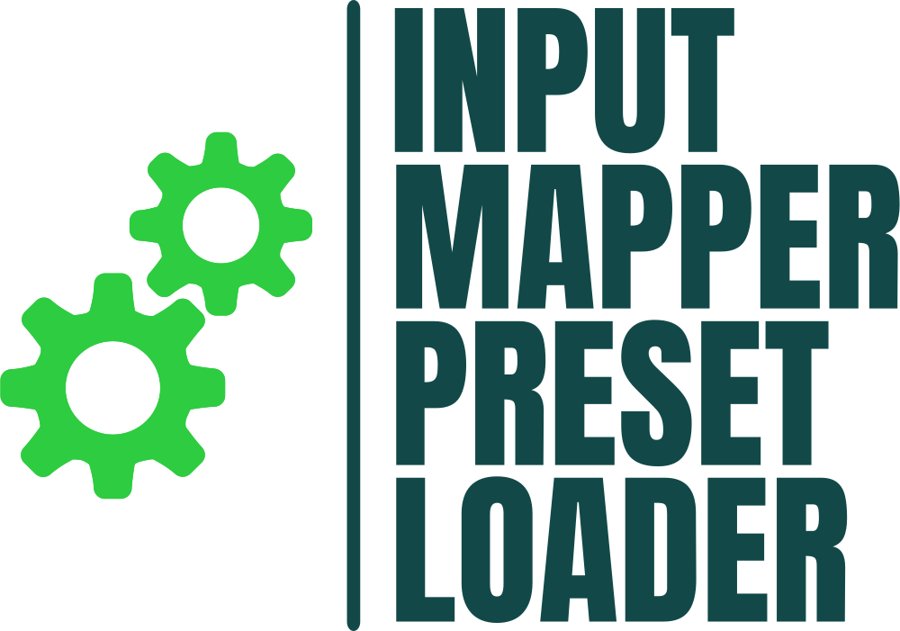
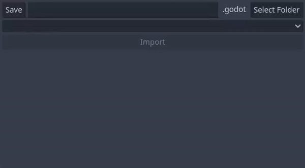

<!--
*** Thanks for checking out the Best-README-Template. If you have a suggestion
*** that would make this better, please fork the repo and create a pull request
*** or simply open an issue with the tag "enhancement".
*** Thanks again! Now go create something AMAZING! :D
***
***
***
*** To avoid retyping too much info. Do a search and replace for the following:
*** EladKarni, InputMapperPresetLoader, twitter_handle, email, Input Mapper Preset Loader, A Godot editor plugin that allows users to save/load premade input mappings

-->

<!-- PROJECT SHIELDS -->
<!--
*** I'm using markdown "reference style" links for readability.
*** Reference links are enclosed in brackets [ ] instead of parentheses ( ).
*** See the bottom of this document for the declaration of the reference variables
*** for contributors-url, forks-url, etc. This is an optional, concise syntax you may use.
*** https://www.markdownguide.org/basic-syntax/#reference-style-links
-->
[![Contributors][contributors-shield]][contributors-url]
[![Forks][forks-shield]][forks-url]
[![Stargazers][stars-shield]][stars-url]
[![Issues][issues-shield]][issues-url]
[![MIT License][license-shield]][license-url]

<!-- PROJECT LOGO -->
 

  

  <h3 align="center">Input Mapper Preset Loader</h3>

  

    

        A Godot editor plugin that allows users to save/load premade input mappings
    

     
    <a href="https://github.com/EladKarni/InputMapperPresetLoader"><strong>Explore the docs »</strong></a>
     
     
    <a href="https://youtu.be/AXzB8PwnmhA">Video Tutorial</a>
    ·
    <a href="https://github.com/EladKarni/InputMapperPresetLoader/releases">Latest Relase</a>
    ·
    <a href="https://github.com/EladKarni/InputMapperPresetLoader/issues">Report Bug</a>
    ·
    <a href="https://github.com/EladKarni/InputMapperPresetLoader/issues">Request Feature</a>
  

<!-- TABLE OF CONTENTS -->

  
<h2 style="display: inline-block">Table of Contents</h2>

  <ol>
    <li>
      <a href="#about-the-project">About The Project</a>
    </li>
    <li>
      <a href="#getting-started">Getting Started</a>
      <ul>
        <li><a href="#prerequisites">Prerequisites</a></li>
        <li><a href="#installation">Installation</a></li>
      </ul>
    </li>
    <li><a href="#usage">Usage</a></li>
    <li><a href="#roadmap">Roadmap</a></li>
    <li><a href="#contributing">Contributing</a></li>
    <li><a href="#license">License</a></li>
    <li><a href="#contact">Contact</a></li>
    <li><a href="#acknowledgements">Acknowledgements</a></li>
  </ol>

<!-- ABOUT THE PROJECT -->
## About The Project

    

This plugin aims to help users when creating a new project. Instead of manually adding all the action and button events to the Input Map screen; this plugin allows users to save/load premade mappings. Presets are saved as `.godot` files which makes sharing also quick and simple.

### Built With

* [Godot](https://godotengine.org/)
* [GDScript](https://docs.godotengine.org/en/stable/tutorials/scripting/gdscript/gdscript_basics.html)

<!-- USAGE EXAMPLES -->
## Usage

To use the plugin, you must download the source code, and put it in a your projects `addon` folder. Once that is done, restart your editor and then:

1. Open Project Settings Window
2. Navigate to the plugin tab
3. Make sure to enable this plugin
4. Restart the editor

<!-- CONTRIBUTING -->
## Contributing

Contributions are what make the open source community such an amazing place to learn, inspire, and create. Any contributions you make are **greatly appreciated**.

1. Fork the Project
2. Create your Feature Branch (`git checkout -b feature/AmazingFeature`)
3. Commit your Changes (`git commit -m 'Add some AmazingFeature'`)
4. Push to the Branch (`git push origin feature/AmazingFeature`)
5. Open a Pull Request

<!-- LICENSE -->
## License

Distributed under the MIT License. See `LICENSE` for more information.

<!-- CONTACT -->
## Contact

Elad Karni - [Main Website](https://eladkarni.com)

Project Link: [https://github.com/EladKarni/InputMapperPresetLoader](https://github.com/EladKarni/InputMapperPresetLoader)

<!-- ACKNOWLEDGEMENTS -->
## Acknowledgements

* [Godot Discord - Plugin Channel](https://discord.com/channels/212250894228652034/659154083130769438)

<!-- MARKDOWN LINKS & IMAGES -->
<!-- https://www.markdownguide.org/basic-syntax/#reference-style-links -->
[contributors-shield]: https://img.shields.io/github/contributors/EladKarni/InputMapperPresetLoader.svg?style=for-the-badge
[contributors-url]: https://github.com/EladKarni/InputMapperPresetLoader/graphs/contributors
[forks-shield]: https://img.shields.io/github/forks/EladKarni/InputMapperPresetLoader.svg?style=for-the-badge
[forks-url]: https://github.com/EladKarni/InputMapperPresetLoader/network/members
[stars-shield]: https://img.shields.io/github/stars/EladKarni/InputMapperPresetLoader.svg?style=for-the-badge
[stars-url]: https://github.com/EladKarni/InputMapperPresetLoader/stargazers
[issues-shield]: https://img.shields.io/github/issues/EladKarni/InputMapperPresetLoader.svg?style=for-the-badge
[issues-url]: https://github.com/EladKarni/InputMapperPresetLoader/issues
[license-shield]: https://img.shields.io/github/license/EladKarni/InputMapperPresetLoader.svg?style=for-the-badge
[license-url]: https://github.com/EladKarni/InputMapperPresetLoader/blob/master/LICENSE